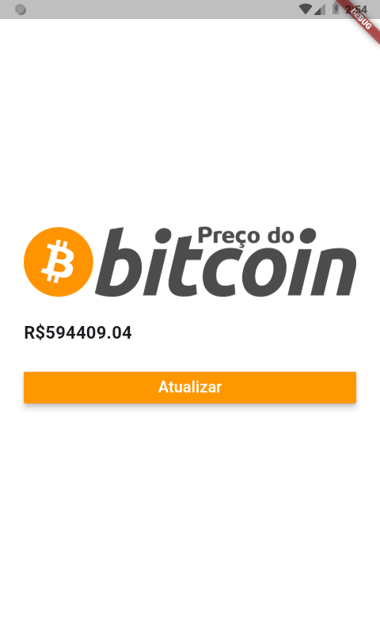
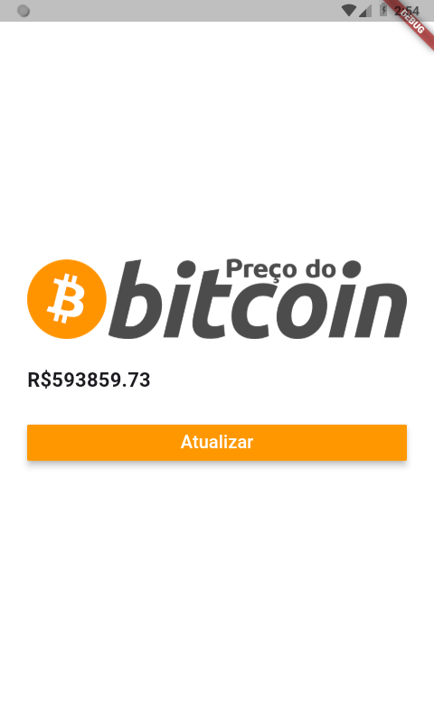

# Bitcoin Price App

This is a simple Flutter application that fetches the current **Bitcoin price in BRL** (Brazilian Real) using the [Blockchain.info API](https://blockchain.info/ticker).

The app displays the current BTC price and allows the user to refresh it with a button click.

---

## Screenshots

### 

### 

---

## Features

- Built with Flutter
- Consumes a real public API (`blockchain.info`)
- Simple and clean UI
- API integration using `http` package

---

## First experience using API

This was my first time working with APIs in Flutter. It helped me understand how `http.get()`, `async/await`, and `json.decode()` work in a real app.

